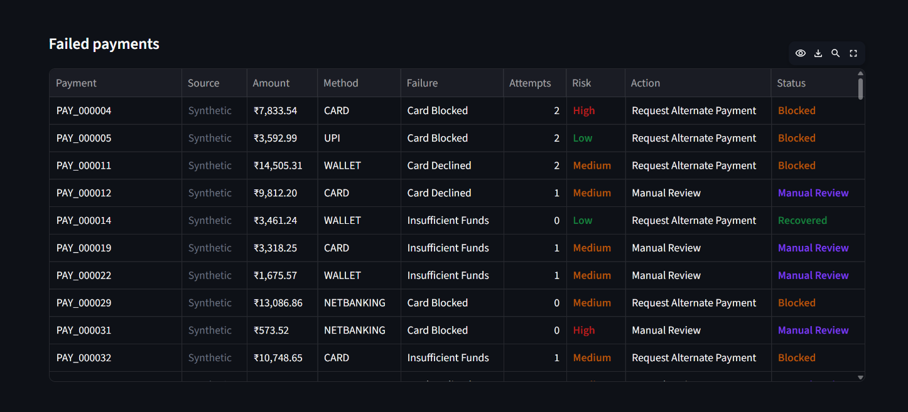
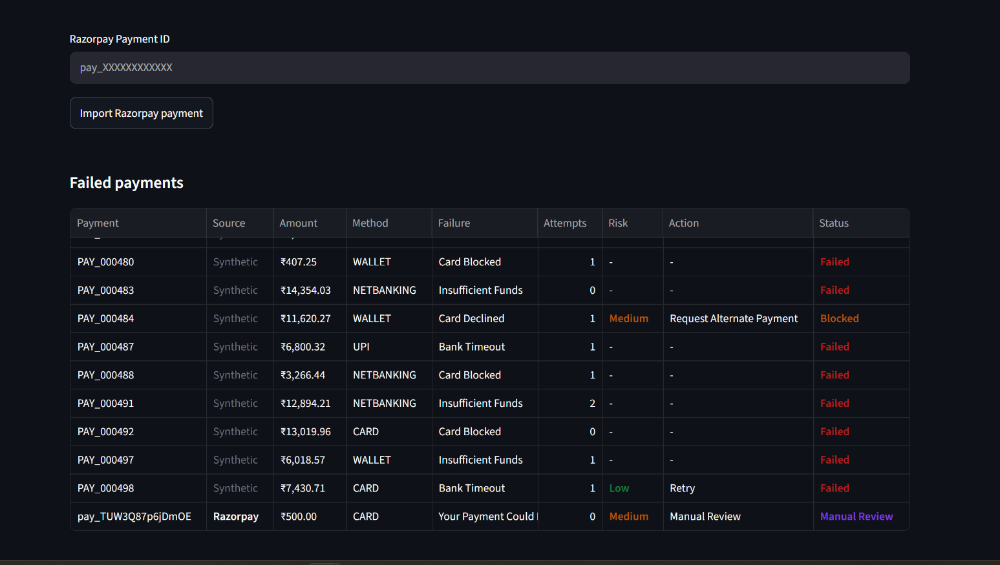
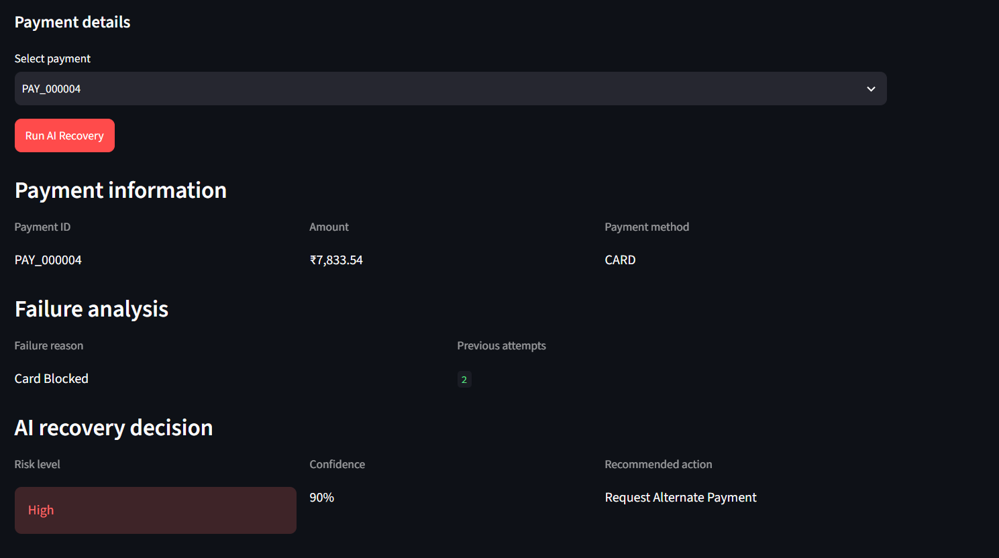

# 💳 AI Revenue Recovery Agent

> An AI-powered system that analyzes failed payments, recommends intelligent recovery actions, and helps businesses recover lost revenue safely.

The system integrates with **Razorpay Test Mode** to ingest failed payments and uses a **Groq-powered AI agent** to diagnose failures, assess risk, and recommend recovery strategies.

Every AI decision passes through a deterministic **Policy Engine** before execution, ensuring safe and controlled recovery.

## 🖥️ Dashboard

### Revenue Recovery Overview


### AI Recovery Decision


### Recovery Activity & Audit Trail



## ✨ Key Features

- 🤖 AI-powered payment failure diagnosis
- 🔄 Smart recovery strategies — Retry, Retry Later, Alternate Payment & Manual Review
- 🛡️ Risk classification and policy guardrails
- 💳 Razorpay Test Mode integration
- ⚡ Individual and batch payment recovery
- 📜 Recovery history and audit logs
- 📊 Revenue-at-risk and recovered-revenue tracking
- 🖥️ Interactive Streamlit dashboard


## 🔄 How It Works

Failed Payment
      ↓
AI Diagnosis
      ↓
Risk Assessment
      ↓
Recovery Recommendation
      ↓
Policy Validation
      ↓
Recovery Execution
      ↓
Audit Log & Dashboard


> **Note:** Razorpay Test Mode is used for payment integration. Recovery execution is simulated and does not perform real customer transactions.


## 🏗️ Architecture


Razorpay Test Mode / Synthetic Payments
                  │
                  ▼
            Failed Payment
                  │
                  ▼
          AI Recovery Agent
                  │
                  ▼
       Diagnosis + Risk + Action
                  │
                  ▼
             Policy Engine
              /        \
         Allowed      Blocked
            │            │
            ▼            ▼
      Recovery Tool    Audit Log
            │
            ▼
      Recovery Result
            │
            ▼
       SQLite Database
            │
            ▼
     Streamlit Dashboard
```

---

🛠️ Tech Stack

Backend: Python, Flask
AI: Groq LLM, LangChain, Pydantic
Payments: Razorpay Test Mode
Database: SQLite, SQLAlchemy
Dashboard: Streamlit, Pandas
Testing: Synthetic payment data + Razorpay Test transactions


🚀 Quick Start

bash
git clone <your-repository-url>
cd AI-Revenue-Recovery
pip install -r requirements.txt
```

Create a `.env` file:
GROQ_API_KEY=your_key
RAZORPAY_KEY_ID=your_test_key
RAZORPAY_KEY_SECRET=your_test_secret


Start the backend:

```bash
python app.py
```

Start the dashboard:

```bash
streamlit run dashboard/app.py
```

---

## 🎯 Demo Flow

**Import Failed Payment → Select Payment → Run AI Recovery → AI Diagnosis → Policy Validation → Recovery Result → Audit Trail**


## ⚠️ Disclaimer

This project is built for demonstration and evaluation purposes. Razorpay is used in **Test Mode**, while recovery execution is simulated.