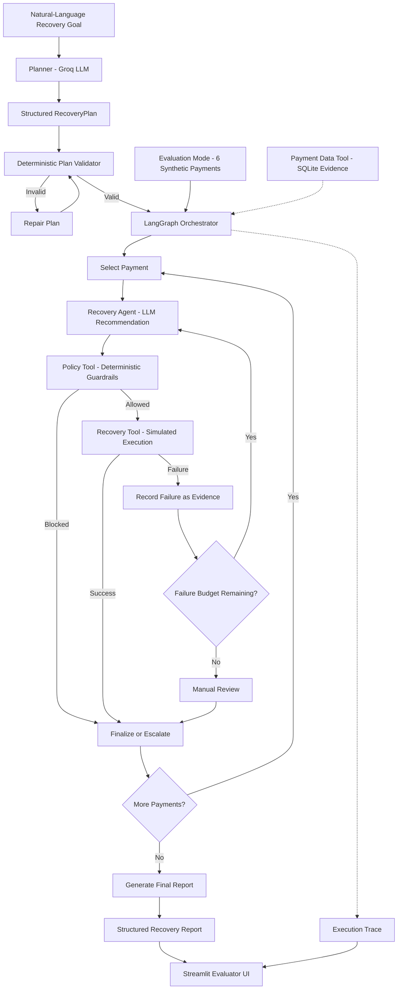

# RevenueOps Agent

> A bounded autonomous AI agent that plans and executes safe recovery workflows for failed payments, adapts when recovery actions fail, respects deterministic business policies, and produces an auditable final report.

RevenueOps Agent was built to demonstrate practical agentic AI engineering rather
than a single LLM call wrapped in an interface.

Given a high-level goal such as:

> **"Analyze today's failed payments, recover eligible revenue while respecting
> company recovery policies, handle unsuccessful recovery attempts safely, and
> produce an auditable recovery report."**

the system generates a plan before execution, investigates a batch of failed
payments, selects recovery strategies, validates every automatic action through
deterministic policy rules, executes approved actions through tools, observes
failures, replans when appropriate, and produces a structured report.

---

## Why This Is Agentic

The workflow demonstrates five core autonomous-agent capabilities:

1. **Planning** — converts a natural-language goal into a structured multi-step plan.
2. **Tool use** — separates payment evidence, policy validation, and recovery execution.
3. **Autonomous execution** — processes the payment batch without step-by-step user intervention.
4. **Failure recovery** — observes failed tool execution and reasons again using the failure as new evidence.
5. **Structured reporting** — produces an auditable execution trace and machine-readable final report.

The central safety principle is:

> **The LLM proposes. Deterministic policy authorizes. Tools execute.**

The language model never has authority to bypass business-policy checks.

---

## Architecture


```mermaid
flowchart TD
    A["Natural-Language Recovery Goal"] --> B["Planner - Groq LLM"]
    B --> C["Structured RecoveryPlan"]
    C --> D["Deterministic Plan Validator"]

    D -->|Invalid| E["Repair Plan"]
    E --> D
    D -->|Valid| F["LangGraph Orchestrator"]

    G["Evaluation Mode - 6 Synthetic Payments"] --> F
    H["Payment Data Tool - SQLite Evidence"] -.-> F

    F --> I["Select Payment"]
    I --> J["Recovery Agent - LLM Recommendation"]
    J --> K["Policy Tool - Deterministic Guardrails"]

    K -->|Blocked| L["Finalize or Escalate"]
    K -->|Allowed| M["Recovery Tool - Simulated Execution"]

    M -->|Success| L
    M -->|Failure| N["Record Failure as Evidence"]

    N --> O{"Failure Budget Remaining?"}
    O -->|Yes| J
    O -->|No| P["Manual Review"]
    P --> L

    L --> Q{"More Payments?"}
    Q -->|Yes| I
    Q -->|No| R["Generate Final Report"]

    R --> S["Structured Recovery Report"]
    F -.-> T["Execution Trace"]

    S --> U["Streamlit Evaluator UI"]
    T --> U
```

For a detailed architecture explanation, see
[`docs/architecture.md`](docs/architecture.md).

---

## Tool Orchestration

The system uses tools with genuinely different responsibilities.

| Tool | Responsibility |
|---|---|
| **Payment Data Tool** | Retrieves failed-payment information and previous recovery evidence |
| **Policy Tool** | Deterministically approves or blocks proposed actions |
| **Recovery Tool** | Simulates execution of approved recovery actions |

This separates:

```text
Observe
   ↓
Reason
   ↓
Authorize
   ↓
Act
```

The recovery agent cannot directly call an unrestricted financial operation.

---

## Planning

Before processing payments, the planner converts the user's goal into a
structured `RecoveryPlan`.

A plan contains:

- the original goal;
- ordered plan steps;
- an objective for each step;
- a rationale for each step;
- execution status.

The plan is validated deterministically before recovery begins.

Validation checks include:

- non-empty goal;
- 5–8 plan steps;
- unique step IDs;
- non-empty objectives;
- non-empty rationales.

If the generated plan is invalid, one repair attempt is allowed. If the plan
remains invalid, the workflow terminates safely before executing recovery
actions.

---

## Adaptive Failure Recovery

`PAY-004` is the primary failure-recovery evaluation case.

Evaluation mode deliberately fails its first `retry` execution.

A representative trace is:

```text
PAY-004 selected
      ↓
Agent recommends retry
      ↓
Policy approves retry
      ↓
Recovery tool executes
      ↓
INJECTED FAILURE
      ↓
Failure recorded as new evidence
      ↓
Agent reasons again
      ↓
Different recovery strategy recommended
      ↓
Policy validates new strategy
      ↓
Recovery succeeds
        OR
failure budget is exhausted
      ↓
Manual review
```

The failure is not hidden or presented as a random production failure. It is
explicitly marked as `injected_failure` in the execution trace.

This demonstrates:

**tool failure → observation → updated state → replanning → safe continuation**

---

## Deterministic Safety Guardrails

LLM recommendations must pass through the policy layer before automatic
execution.

Current policy examples include:

- automatic recovery amount must not exceed **₹10,000**;
- a case cannot exceed the configured recovery-attempt limit;
- only explicitly supported automatic actions can execute.

For example, the evaluation case `PAY-003` contains a ₹15,000 failed payment.

The LLM may recommend a recovery action, but the deterministic policy layer
blocks it:

```text
LLM Recommendation
        ↓
Deterministic Policy Check
        ↓
₹15,000 > ₹10,000 limit
        ↓
POLICY BLOCKED
        ↓
Recovery Tool Is Not Called
```

This behavior is captured in:

```text
evaluation/logs/policy_safety_demo.json
```

---

## Bounded Autonomy

Autonomous recovery is deliberately limited.

A payment can experience at most two unsuccessful autonomous recovery attempts
during a case.

If that failure budget is exhausted:

```text
Autonomous Recovery Stops
          ↓
     Manual Review
```

This prevents infinite recovery loops and provides a clear human-escalation
boundary.

---

## Evaluation Scenarios

The evaluator uses six synthetic payment cases.

| Payment | Scenario | Expected Behavior |
|---|---|---|
| `PAY-001` | Low-value bank timeout | Automatic recovery candidate |
| `PAY-002` | Insufficient funds | Context-aware recovery strategy |
| `PAY-003` | ₹15,000 payment | Blocked by automatic-recovery amount policy |
| `PAY-004` | Gateway failure | Deliberate first failure followed by replanning |
| `PAY-005` | Previous recovery attempts exhausted | Policy blocked |
| `PAY-006` | Standard recoverable failure | Automatic recovery candidate |

These scenarios are synthetic by design so important workflow branches can be
demonstrated repeatedly without making real payment-provider calls.

---

## Evaluation Artifacts

Three sample evaluation artifacts are included.

### 1. Full Autonomous Run

```text
evaluation/logs/demo_run.json
```

Contains the complete workflow trace including:

- plan creation;
- plan validation;
- payment selection;
- LLM recommendations;
- policy decisions;
- recovery execution;
- deliberate failure;
- failure recording;
- replanning;
- case finalization;
- final report.

### 2. Policy Safety

```text
evaluation/logs/policy_safety_demo.json
```

Demonstrates that `PAY-003` is blocked by deterministic policy and never reaches
the recovery execution tool.

The artifact explicitly verifies:

```json
{
  "policy_block_observed": true,
  "recovery_execution_observed": false,
  "execution_prevented": true
}
```

### 3. Plan Repair

```text
evaluation/logs/plan_repair_demo.json
```

Demonstrates detection of a deliberately invalid plan, repair-node execution,
and successful revalidation.

For deterministic evaluation, the external LLM repair response in this artifact
is mocked. The workflow's validation, repair transition, and revalidation logic
are exercised, but this artifact is not presented as a recording of a live LLM
repair request.

---

## Structured Final Output

After processing the batch, the agent produces a structured report containing:

```json
{
  "goal": "...",
  "summary": {
    "total_payments": 6,
    "total_revenue_at_risk": 30000,
    "recovered_payments": "...",
    "recovered_revenue": "...",
    "policy_blocked_payments": "...",
    "manual_review_payments": "...",
    "failed_recovery_attempts": "..."
  },
  "cases": []
}
```

Recovery totals may vary between runs because LLM recommendations can vary and
different approved simulated strategies can have different deterministic
outcomes.

The important evaluation invariants are the safety and routing properties, not
one fixed recovered-revenue number.

---

## Execution Trace

Every important workflow transition is recorded as structured evidence.

Example event types include:

```text
plan_created
plan_validated
payments_loaded
payment_selected
recovery_recommended
policy_approved
policy_blocked
recovery_succeeded
recovery_failed
recovery_failure_recorded
case_finalized
report_generated
```

This allows an evaluator to reconstruct what the system decided, which policy
was applied, which tool was executed, what failed, and how the agent responded.

---

## Streamlit Evaluator

The Streamlit interface is intentionally designed as an **evaluation console**
rather than a production payment dashboard.

It displays:

1. the natural-language recovery goal;
2. the generated plan;
3. aggregate recovery results;
4. individual payment outcomes;
5. the `PAY-004` failure/replanning story;
6. the full technical execution trace;
7. the structured final report.

Evaluation mode is clearly identified as synthetic and uses explicit fault
injection.

---

## Tech Stack

| Area | Technology |
|---|---|
| Language | Python 3.11 |
| Agent orchestration | LangGraph |
| LLM integration | LangChain + LangChain Groq |
| LLM provider | Groq |
| Structured contracts | Pydantic |
| Evaluation UI | Streamlit |
| Data layer | SQLite + SQLAlchemy |
| Testing | pytest |

---

## Repository Structure

```text
RevenueOps-Agent/
├── agents/
│   ├── planner.py
│   ├── plan_validator.py
│   └── recovery_agent.py
│
├── dashboard/
│   └── app.py
│
├── database/
│   ├── connection.py
│   ├── init_db.py
│   └── models.py
│
├── demo/
│   └── scenarios.py
│
├── docs/
│   ├── architecture.md
│   └── design-and-limitations.md
│
├── evaluation/
│   ├── logs/
│   │   ├── demo_run.json
│   │   ├── plan_repair_demo.json
│   │   └── policy_safety_demo.json
│   ├── create_policy_safety_log.py
│   ├── run_demo.py
│   └── run_plan_repair_demo.py
│
├── graph/
│   ├── nodes.py
│   ├── state.py
│   └── workflow.py
│
├── models/
│   └── agent_models.py
│
├── tests/
│   ├── conftest.py
│   ├── test_demo_scenarios.py
│   ├── test_failure_recovery.py
│   ├── test_plan_recovery.py
│   └── test_workflow_routing.py
│
├── tools/
│   ├── payment_tool.py
│   ├── policy_tool.py
│   └── recovery_tool.py
│
├── requirements.txt
└── README.md
```

---

## Setup

### 1. Clone the repository

```bash
git clone <YOUR_REPOSITORY_URL>
cd RevenueOps-Agent
```

### 2. Create a Python environment

Using Conda:

```bash
conda create -n revenueops-agent python=3.11
conda activate revenueops-agent
```

### 3. Install dependencies

```bash
pip install -r requirements.txt
```

### 4. Configure Groq

Create a `.env` file in the project root:

```env
GROQ_API_KEY=your_groq_api_key
```

The `.env` file is ignored by Git and must never be committed.

No real payment-provider credentials are required for the included evaluation
workflow.

---

## Run the Evaluator UI

From the project root:

```bash
streamlit run dashboard/app.py
```

Enter or keep the default recovery goal and click:

```text
Run Autonomous Recovery
```

The workflow will plan and process all six evaluation payments autonomously.

---

## Run the Full Evaluation

```bash
python evaluation/run_demo.py
```

This generates or updates:

```text
evaluation/logs/demo_run.json
```

---

## Run the Plan-Repair Evaluation

```bash
python evaluation/run_plan_repair_demo.py
```

This exercises the deterministic invalid-plan/repair evaluation path.

---

## Generate the Policy-Safety Artifact

After a demo log exists:

```bash
python evaluation/create_policy_safety_log.py
```

This extracts and verifies the `PAY-003` policy-block path from the recorded
demo execution.

---

## Run Tests

```bash
pytest -v
```

Current test suite:

```text
19 passed
```

The tests cover:

- deterministic demo scenarios;
- policy blocking;
- prevention of execution after policy rejection;
- explicit fault injection;
- failed execution becoming new agent evidence;
- bounded replanning;
- manual-review routing;
- plan validation;
- plan repair;
- safe workflow abort;
- graph routing.

---

## 3–5 Minute Evaluator Demo

A short evaluator walkthrough can follow this sequence.

### 1. Show the Goal and Generated Plan

Start the Streamlit app and run the default goal.

Point out that the plan is generated **before recovery execution begins**.

### 2. Show the Three Tool Boundaries

Explain:

```text
Payment Data → evidence
Policy Tool  → authorization
Recovery Tool → execution
```

Then highlight:

> **The LLM proposes; deterministic policy authorizes; tools execute.**

### 3. Show `PAY-003`

The LLM recommends an action, but the ₹15,000 amount exceeds the automatic
recovery limit.

Show that:

```text
policy_blocked
```

occurs and there is no recovery execution event for that payment.

### 4. Show `PAY-004`

This is the main robustness demonstration.

Show:

```text
retry
→ policy approved
→ injected failure
→ failure recorded
→ LLM reasons again
→ alternative strategy
→ policy validation
→ recovery or safe manual escalation
```

This demonstrates actual adaptation to observed tool failure.

### 5. Show the Final Report and Tests

Open the structured final report and briefly show the execution trace.

Then run:

```bash
pytest -v
```

to demonstrate the workflow invariants are covered by automated tests.

---

## Documentation

Detailed technical documentation is available here:

- [Architecture](docs/architecture.md)
- [Design Decisions & Limitations](docs/design-and-limitations.md)

---

## Limitations

This is an evaluation system, not production payment infrastructure.

Important limitations include:

- recovery execution is simulated;
- evaluation payments are synthetic;
- no real customer messages are sent;
- no real payment-provider recovery calls are performed;
- external LLM output can vary;
- the evaluator uses a deterministic fixture instead of live SQLite data;
- business policies are intentionally simplified;
- production-grade idempotency, authorization, durable workflow persistence,
  observability, compliance, and human-review infrastructure are out of scope.

See [`docs/design-and-limitations.md`](docs/design-and-limitations.md) for the
full discussion.

---

## Safety Notice

RevenueOps Agent does **not** perform real customer charges.

The included recovery tool is a simulator used to demonstrate autonomous
planning, tool orchestration, failure handling, policy enforcement, and
reporting.

The project is intended for engineering evaluation and demonstration purposes.