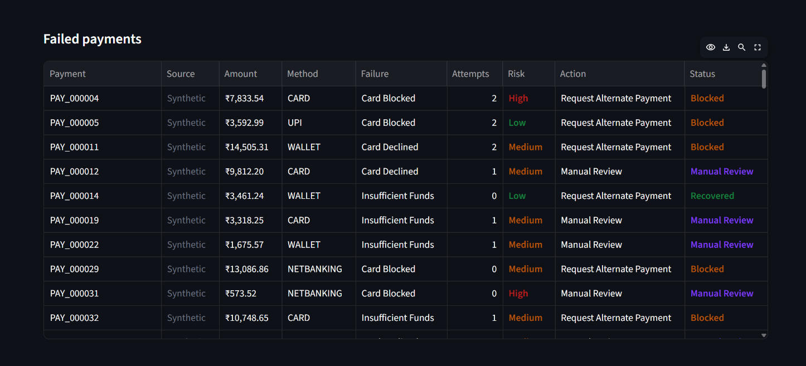
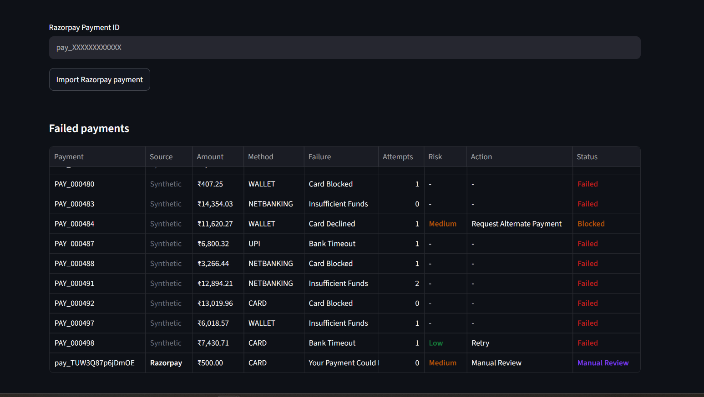
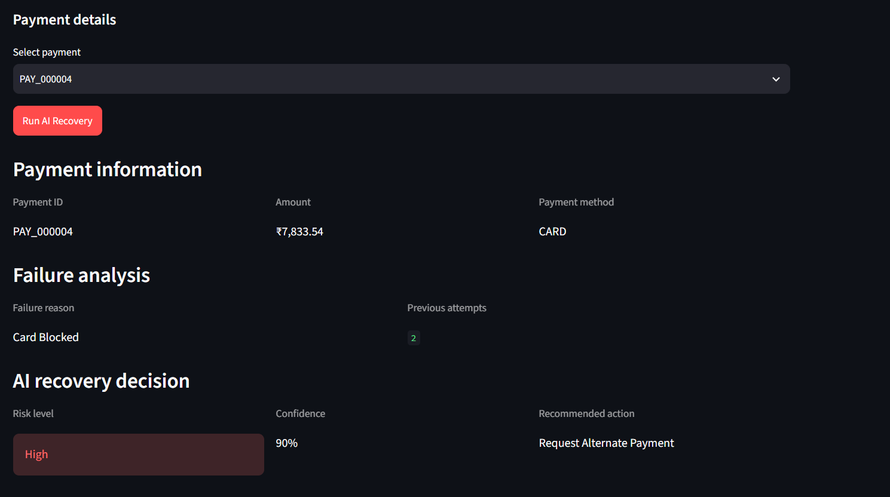

# 💳 AI Revenue Recovery Agent

> An AI-powered agentic system that analyzes failed payments, recommends intelligent recovery actions, and helps businesses recover revenue safely.

The system integrates with **Razorpay Test Mode** to ingest failed payments and uses a **Groq-powered AI agent with LangChain** to diagnose payment failures, assess risk, and recommend appropriate recovery strategies.

Every AI-generated action passes through a deterministic **Policy Engine** before execution, ensuring recovery actions remain safe, explainable, and controlled.

---

## 🖥️ Dashboard

### Revenue Recovery Overview



### AI Recovery Decision



### Recovery Activity & Audit Trail



---

## ✨ Key Features

- 🤖 **AI-Powered Failure Diagnosis** — analyzes payment failures and determines potential causes
- 🧠 **Intelligent Recovery Recommendations** — generates context-aware recovery actions using Groq + LangChain
- 🔄 **Multiple Recovery Strategies** — Retry, Retry Later, Alternate Payment, Notify Customer, and Manual Review
- 🛡️ **Policy Guardrails** — validates AI recommendations before execution
- ⚠️ **Risk Classification** — evaluates transaction risk before allowing recovery actions
- 💳 **Razorpay Test Mode Integration** — imports and processes test payment data
- ⚡ **Individual & Batch Recovery** — processes single payments or multiple eligible recovery cases
- 📜 **Audit Trail** — records AI decisions, policy outcomes, and recovery attempts
- 📊 **Revenue Analytics** — tracks revenue at risk, recoverable revenue, recovered revenue, and recovery outcomes
- 🖥️ **Interactive Dashboard** — Streamlit interface for monitoring and executing recovery workflows

---

## 🔄 How It Works

```text
Failed Payment
      ↓
AI Diagnosis
      ↓
Risk Assessment
      ↓
Recovery Recommendation
      ↓
Policy Validation
      ↓
Recovery Execution
      ↓
Audit Log & Dashboard
```

> **Note:** Razorpay Test Mode is used for payment integration. Recovery execution is simulated and does not perform real customer transactions.

---

## 🏗️ Architecture

```text
Razorpay Test Mode / Synthetic Payments
                  │
                  ▼
            Failed Payment
                  │
                  ▼
          AI Recovery Agent
          (Groq + LangChain)
                  │
                  ▼
       Diagnosis + Risk + Action
                  │
                  ▼
             Policy Engine
              /        \
         Allowed       Blocked
            │             │
            ▼             ▼
     Recovery Tool     Audit Log
            │
            ▼
      Recovery Result
            │
            ▼
       SQLite Database
            │
            ▼
     Streamlit Dashboard
```

---

## 🛠️ Tech Stack

| Component | Technology |
|---|---|
| **Backend** | Python, Flask |
| **AI / Agent** | Groq LLM, LangChain, Pydantic |
| **Payments** | Razorpay Test Mode |
| **Database** | SQLite, SQLAlchemy |
| **Dashboard** | Streamlit, Pandas |
| **Testing** | Synthetic Payment Data + Razorpay Test Transactions |

---

## 📊 Recovery Metrics

The system includes batch evaluation to measure recovery performance across simulated failed-payment scenarios.

| Metric | Result |
|---|---:|
| Revenue at Risk | ₹11,64,390.41 |
| Recoverable Revenue | ₹5,60,845.81 |
| Eligible Recovery Cases | 92 |
| Successful Recoveries | 37 |
| Failed Recovery Attempts | 28 |
| Policy-Blocked Actions | 27 |
| Simulated Revenue Recovered | ₹1,69,165.20 |

> Metrics are generated from synthetic/test payment scenarios and simulated recovery execution. They do not represent real customer transactions.

---

## 🛡️ Policy-Controlled AI Execution

The AI agent does **not directly execute recovery actions**.

Every recommendation is first evaluated by the deterministic Policy Engine.

```text
AI Recommendation
        │
        ▼
  Policy Validation
     /       \
 ALLOWED    BLOCKED
    │          │
    ▼          ▼
Execute     Audit Log
Recovery    + Reason
```

This separation keeps the LLM responsible for **reasoning and recommendations**, while deterministic business rules control whether an action is allowed to execute.

---

## 🚀 Quick Start

### 1. Clone the repository

```bash
git clone <your-repository-url>
cd AI-Revenue-Recovery
```

### 2. Install dependencies

```bash
pip install -r requirements.txt
```

### 3. Configure environment variables

Create a `.env` file in the project root:

```env
GROQ_API_KEY=your_groq_api_key
RAZORPAY_KEY_ID=your_razorpay_test_key_id
RAZORPAY_KEY_SECRET=your_razorpay_test_key_secret
```

> Never commit your `.env` file or API credentials to GitHub.

### 4. Start the backend

```bash
python app.py
```

### 5. Start the dashboard

Open another terminal and run:

```bash
streamlit run dashboard/app.py
```

---

## 🎯 Demo Flow

```text
Import Failed Payment
        ↓
Select Payment
        ↓
Run AI Recovery
        ↓
AI Diagnosis
        ↓
Risk Assessment
        ↓
Recovery Recommendation
        ↓
Policy Validation
        ↓
Recovery Result
        ↓
Audit Trail
```

---

## 🔐 Safety & Guardrails

The system follows a **policy-controlled agentic architecture**:

- AI recommendations cannot bypass the Policy Engine
- High-risk or policy-violating actions can be blocked
- Recovery attempts are recorded for traceability
- AI decisions include confidence and risk assessments
- Recovery execution is simulated
- Razorpay operates exclusively in Test Mode

---

## ⚠️ Disclaimer

This project is built for **demonstration, learning, and evaluation purposes**.

**Razorpay Test Mode** is used for payment integration, and recovery execution is simulated. The system does **not perform real customer charges or production payment recovery**.