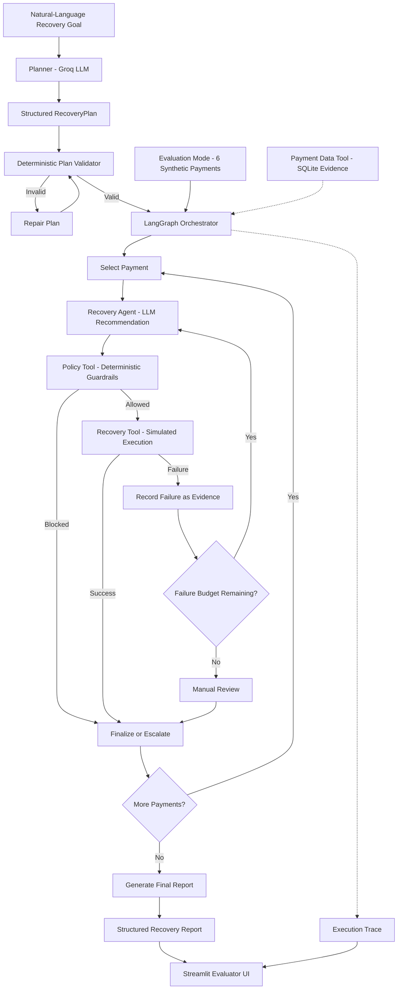

# RevenueOps Agent — Architecture

## System Architecture

## Core Safety Boundary

> **The LLM proposes actions. Deterministic policy code authorizes them. Only approved actions can reach the recovery tool.**

The language model is responsible for planning, diagnosis, and adaptive
recommendations. It does not have authority to bypass deterministic business
rules.

This separation ensures that probabilistic LLM reasoning cannot directly
authorize a financial recovery action.

## Main Components

### 1. Planner

The planner receives a high-level natural-language recovery goal and uses a
Groq-hosted language model to generate a structured `RecoveryPlan`.

The plan describes the objectives the system should accomplish without
inventing payment IDs, recovery outcomes, or unsupported tools.

### 2. Plan Validator

The generated plan is checked using deterministic validation rules before any
payment recovery begins.

The validator checks properties such as:

- the plan contains a goal;
- the plan contains between 5 and 8 steps;
- step IDs are unique;
- every step has an objective and rationale.

If validation fails, the workflow allows one repair attempt. If the repaired
plan is still invalid, the workflow aborts safely instead of beginning recovery.

### 3. LangGraph Orchestrator

LangGraph controls the stateful workflow.

It is responsible for:

- moving between planning and execution stages;
- selecting payments from the batch;
- routing recommendations through policy validation;
- invoking recovery execution only after approval;
- detecting unsuccessful recovery attempts;
- routing failures back to the recovery agent;
- enforcing the failure budget;
- finalizing each payment case;
- generating the final report.

The graph therefore controls workflow transitions while the LLM is used only
for tasks that require reasoning.

### 4. Recovery Agent

For each selected payment, the recovery agent examines the available evidence
and recommends one of the supported recovery strategies.

Supported actions are:

- `retry`
- `request_alternate_payment`
- `notify_and_retry_later`
- `manual_review`

When an execution attempt fails, the failure is added to the payment's recovery
history. The recovery agent then receives this updated evidence when it reasons
about the case again.

This allows the workflow to adapt rather than blindly repeating the same
action.

### 5. Deterministic Policy Tool

Every proposed automatic recovery action must pass through the policy tool
before execution.

The policy layer enforces hard business constraints such as:

- maximum amount allowed for automatic recovery;
- maximum number of automatic recovery attempts;
- supported automatic recovery actions.

A blocked action never reaches the recovery execution tool.

This creates the main safety boundary between probabilistic reasoning and
financial action.

### 6. Recovery Tool

The recovery tool simulates the execution of approved recovery actions.

Execution outcomes are deterministic for a given payment and action so that
evaluation behavior can be reproduced.

The tool also supports explicit fault injection for evaluation purposes.

It does not perform real payment-provider operations.

## Tool Responsibilities

| Component | Responsibility |
|---|---|
| Payment Data Tool | Retrieves payment information and previous recovery evidence |
| Policy Tool | Deterministically approves or blocks proposed recovery actions |
| Recovery Tool | Simulates execution of approved recovery actions |
| Planner | Converts the high-level goal into a structured recovery plan |
| Recovery Agent | Diagnoses individual cases and recommends recovery strategies |
| LangGraph | Controls state transitions, failure handling, bounded replanning, and reporting |

## Data Sources

The project contains two data paths with different purposes.

### Evaluation Path

The evaluator uses six synthetic payment scenarios defined specifically for
repeatable testing and demonstration.

These scenarios cover:

- successful automatic recovery;
- insufficient-funds recovery;
- high-value policy blocking;
- deliberate execution failure and replanning;
- exhausted recovery attempts;
- standard retry recovery.

The synthetic scenarios allow important branches of the workflow to be tested
without depending on an external payment provider.

### Payment Data Tool

The project also contains a SQLite-backed payment data tool capable of
retrieving failed-payment evidence and previous recovery history from the
project's data models.

The current evaluator intentionally uses the deterministic synthetic fixture
instead of treating the SQLite database as live production payment data.

## Failure Recovery

`PAY-004` is the main execution-failure evaluation scenario.

Its first `retry` attempt is deliberately failed through explicit fault
injection.

The workflow then:

1. detects the failed tool execution;
2. records the failed action as new evidence;
3. increments the case failure count;
4. invokes the recovery agent again with the updated history;
5. allows the agent to recommend a different strategy;
6. validates the new strategy through the deterministic policy layer;
7. executes the action only if policy permits it.

Depending on the deterministic execution outcome of the alternative strategy,
the payment is either recovered or eventually escalated to manual review after
the failure budget is exhausted.

The injected failure is explicitly marked in the execution trace and is not
presented as a naturally occurring provider failure.

## Bounded Autonomy

The system deliberately limits autonomous behavior.

A payment can experience at most two unsuccessful autonomous recovery attempts
during a case. Once that failure budget is exhausted, the workflow stops
replanning and sends the case to manual review.

This prevents infinite retry loops and provides a clear human-escalation
boundary.

## Execution Trace

The workflow records structured events throughout execution.

Examples include:

- `plan_created`
- `plan_validated`
- `payments_loaded`
- `payment_selected`
- `recovery_recommended`
- `policy_approved`
- `policy_blocked`
- `recovery_succeeded`
- `recovery_failed`
- `recovery_failure_recorded`
- `case_finalized`
- `report_generated`

The execution trace makes it possible to reconstruct what the agent attempted,
why an action was allowed or blocked, what happened during execution, and how
the workflow responded to failure.

## Structured Final Report

After all payment cases have been processed, the workflow generates a
machine-readable recovery report containing:

- total payments processed;
- total revenue at risk;
- recovered payments;
- recovered revenue;
- policy-blocked payments;
- manual-review payments;
- failed recovery attempts;
- individual case outcomes.

The Streamlit evaluator displays both this final report and the execution trace.

## Evaluation Safety

The included evaluation environment is intentionally simulated.

No real payment is charged.

No real customer notification is sent.

No real payment-provider recovery action is executed.

Fault injection is explicit and used only to demonstrate failure detection,
replanning, and safe escalation.